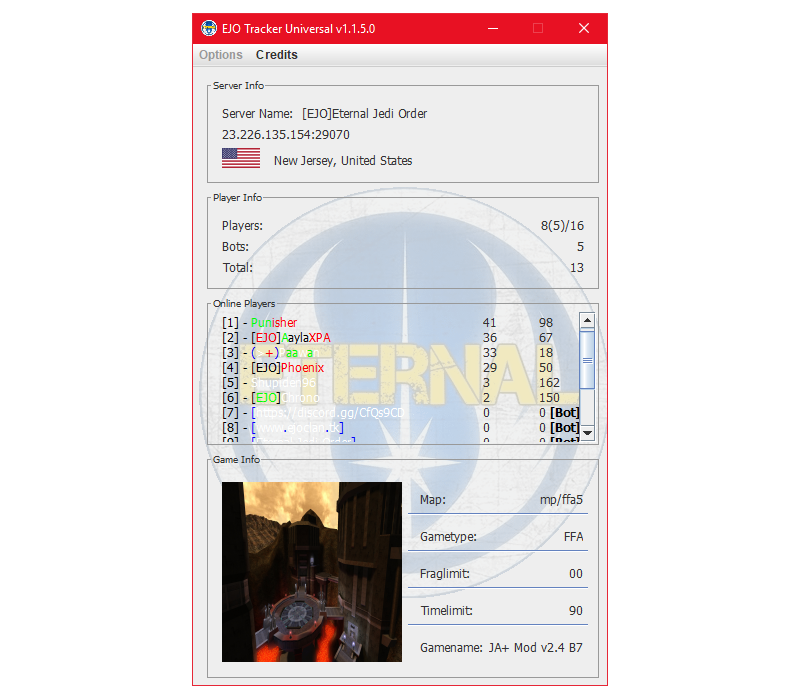

# EJO Tracker Universal

The EJO Tracker Universal is a program that allows you to track a Star Wars Jedi Knight: Jedi Academy server.  
It was originally designed to work only for the <abbr title="Eternal Jedi Order">EJO</abbr>'s clan server.
However, the server has been down for a while, and I decided to update this tool to allow you to input any server IP and port so that you can track other servers.  
This project started in 2019 and has been inactive.  

**Widescreen levelshots 1.1** (map images) by: **Slash**  
[https://jkhub.org/files/file/4179-widescreen-levelshots/](https://jkhub.org/files/file/4179-widescreen-levelshots/)

## Installation

### Prerequisites

- [Java 8+](https://www.java.com/en/download/)

### Run

Head to the [Releases](https://github.com/ShadowXPA/ejo-tracker-uni/releases/latest) tab and download the latest version available.  
To run the application simply double-click the `.jar` file.  
